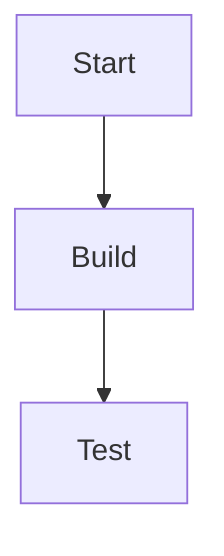

# Balloon Rocket Challenge: Forces & Motion

**Grade:** 3 | **Subject:** Science | **Duration:** 45 min

In this lesson, students build a balloon rocket to explore thrust, friction, and iteration.

## Learning Objectives
1. Explain how thrust moves an object.
2. Record observations during testing.
3. Communicate improvements using evidence.

## Materials
- Balloon
- String (3–5 m)
- Straw
- Tape
- Scissors

## Activities

### 1. Build (15 min)
**Steps:**
1. Thread the string through a straw.
2. Tape the balloon to the straw.
3. Inflate (do not tie), pinch, and release.

| Part | Count |
| --- | ---: |
| Balloon | 1 |
| Straw | 1 |

### 2. Test & Iterate (20 min)
- Change balloon size
- Change string tension
- Repeat trials (3x)

## Assessment
- Students explain cause/effect using observations.
- Students record results in a table.

## Standards
- NGSS 3-PS2-1

## 延伸活動
- 用中文寫下你的觀察：推力、摩擦力、距離
